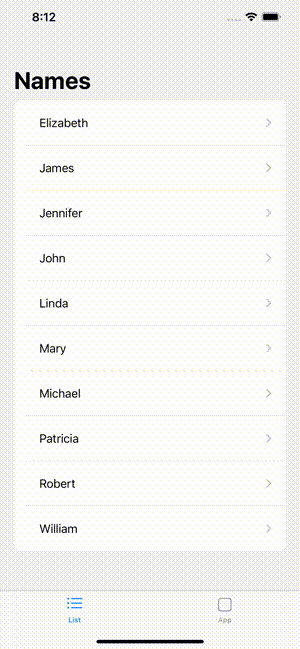

# UndoController

The controller that allows a user to undo an action within seconds. It looks like the system HUDs.




## Installation

1. Add **UndoController.swift** file to your project.

   That's all. There are no dependencies.


## Usage

You can download and run the project to explore the `UndoController` features.

These are the main points to pay attention to.

1. Create an `UndoController` instance.

   ```swift
   @StateObject private var undoController: UndoController = UndoController()
   ```

   If you are not satisfied with the standard indents, use the `UndoController(indents:)` initializer.

   ```swift
   @StateObject private var undoController: UndoController = UndoController(indents: EdgeInsets(top: 0, leading: 20, bottom: 20, trailing: 20))
   ```

2. Add `UndoController` to the desired View.

   It is recommended to add to the view that occupies the entire screen area. For example, to `NavigationView`.

   ```swift
   NavigationView {
       List {
           ForEach(names, id: \.self) { name  in
               NavigationLink(destination: Text(name).padding().font(.largeTitle)) {
                   Text(name)
                       .padding()
               }
           }
           .onDelete(perform: delete)
       }
   //  .add(undoController) // The next View in the NavigationView stack overlaps UndoController when the NavigationLink is activated.
   }
   .add(undoController) // Stays above NavigationView when NavigationLink is activated.
   ```

   To access `UndoController` from nested Views, `EnvironmentObject` wrapper can be used.

   In this case, the `UndoController`, will be available from any application View.

   ```swift
   struct Application: App {
       @StateObject private var undoController: UndoController = UndoController()
       
       var body: some Scene {
           WindowGroup {
               ContentView()
                   .environmentObject(undoController)
                   .add(undoController)
           }
       }
   }
   ```

   **Note**, in this case the `UndoController` will overlap Views such as `TabView`. To avoid this, add the controller only to necessary Views (`NavigationView`, `List`, etc.) or increase its indentation.

3. Call the `UndoController` when needed. In this case, it happens when user deletes a name from the `List`.

   Please note that when the **Show** method is called multiple times, all closures (except the last one) required to undo user actions are removed.

   ```swift
   func delete(at offsets: IndexSet) {
       ...
       // Shows UndoController after name is deleted.
       undoController.show(message: "After deletion, the name cannot be restored!") {
           // Actions required to undo name deletion.
       }
   }
   ```

   To undo actions you can write your own code or use the system [UndoManager](https://developer.apple.com/documentation/foundation/undomanager).

   The **Show** function accepts the following parameters:

   * **message**: The message text that is displayed on the `UndoController`.
   * **time**: The `UndoController` lifetime. *The default value is 5 sec.*
   * **timerAction**: The action that will be performed if the `UndoController`'s life time has expired. *It can be nil.*
   * **undoAction**: The action that will be performed if a user undoes the action.

